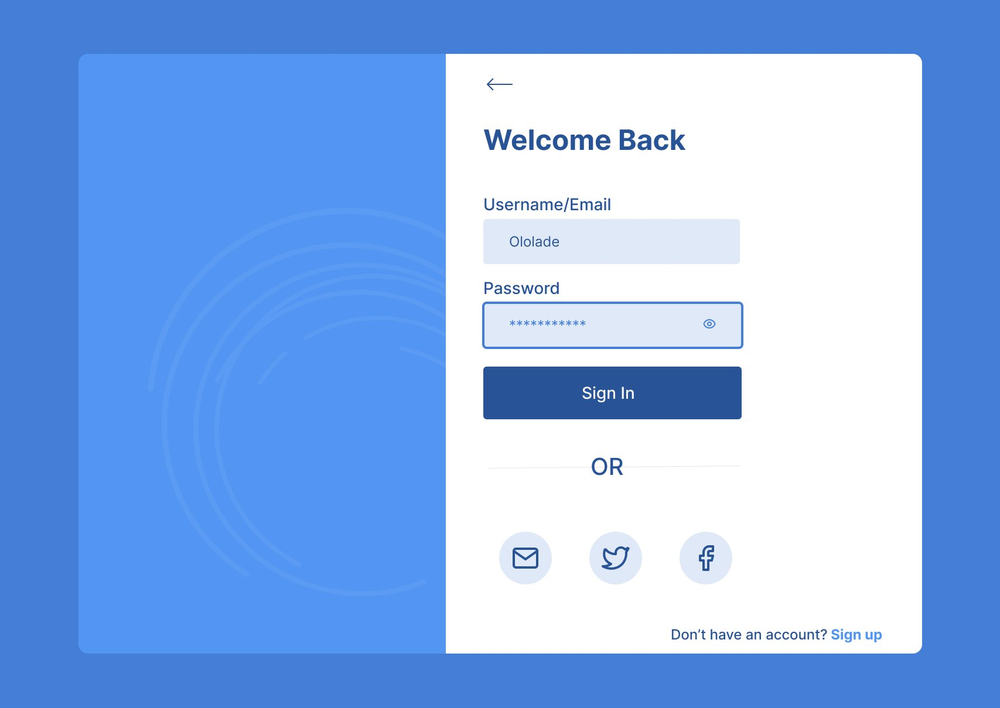
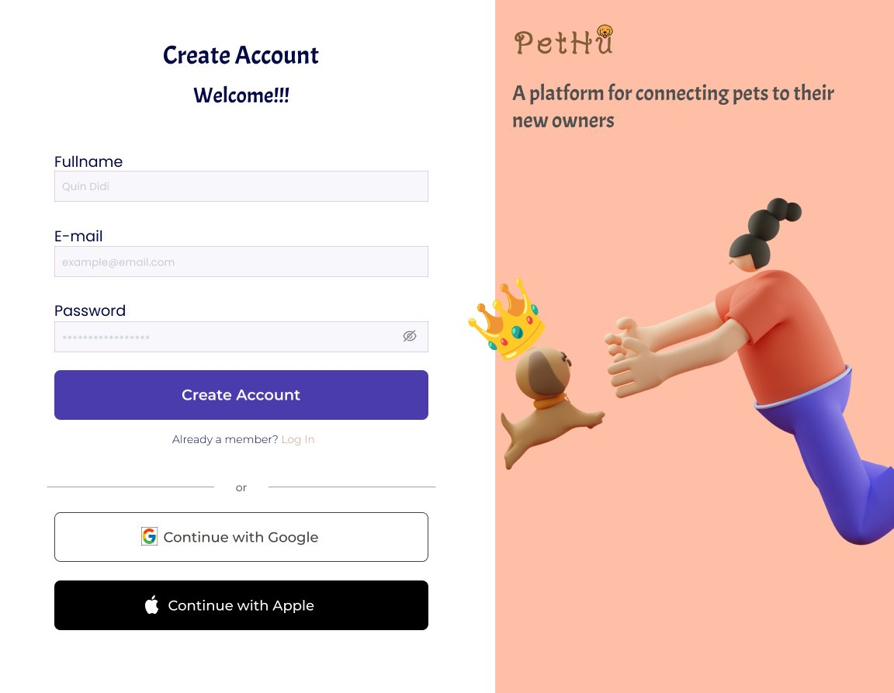
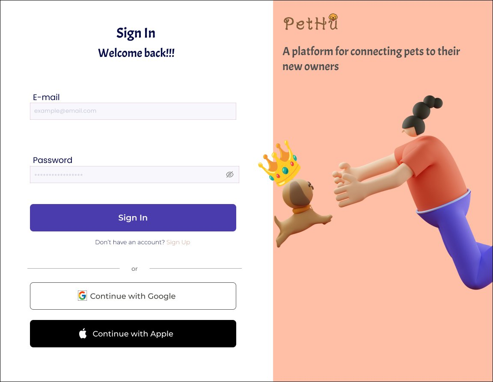
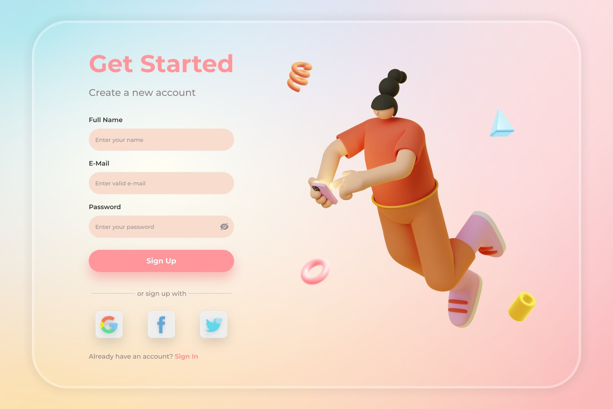

# Signup nd Signin pages
Day 3 of 15 UX designs

#### Design 1

> Color: #2c5596 #359 darkslateblue  hsl(216,54%,38%)  rgb(44,85,150)
>  background-color: #5395f3 #59f cornflowerblue  hsl(215,86%,63%)  rgb(83,149,243)
> button-color:  #285397 #359 darkslateblue  hsl(216,58%,37%)  rgb(40,83,151)
> overall-background-color: #457ed7 #48d royalblue  hsl(216,64%,55%)  rgb(69,126,215)
> input-fields-color: #e0e9f8 #eff lavender  hsl(217,63%,92%)  rgb(224,233,248)

#### Design 2

> Color: 
>  background-color:
> button-color: 
> overall-background-color:

#### Design 3

> Color: 
>  background-color:
> button-color: 
> overall-background-color:

#### Design 4

> Color: 
>  background-color:
> button-color: 
> overall-background-color:

#### Design 5

> Color: 
>  background-color:
> button-color: 
> overall-background-color:

#### Design 6

> Color: 
>  background-color:
> button-color: 
> overall-background-color:

#### Design 7

> Color: 
> background-color:
> button-color: 
> overall-background-color:

