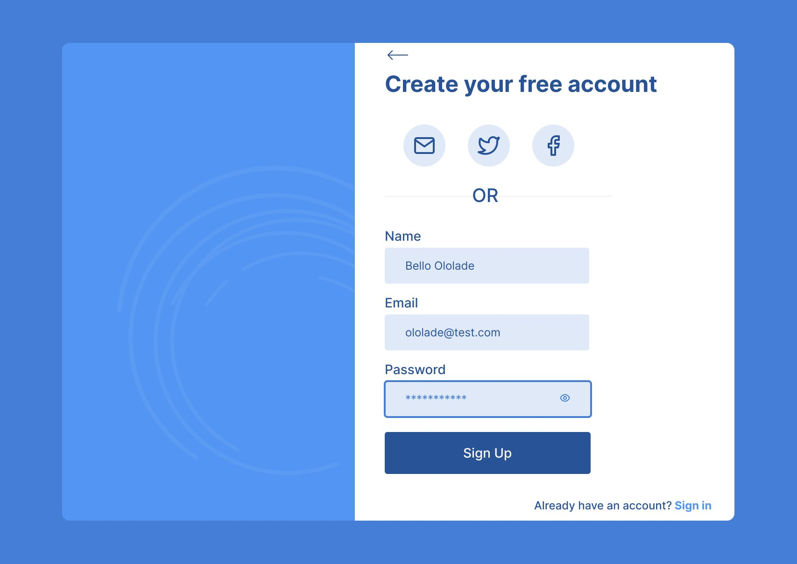
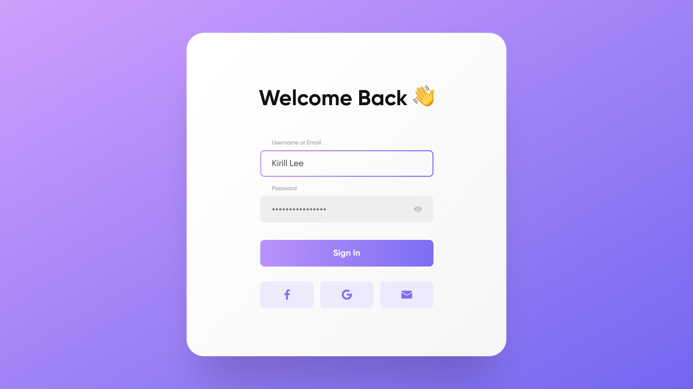
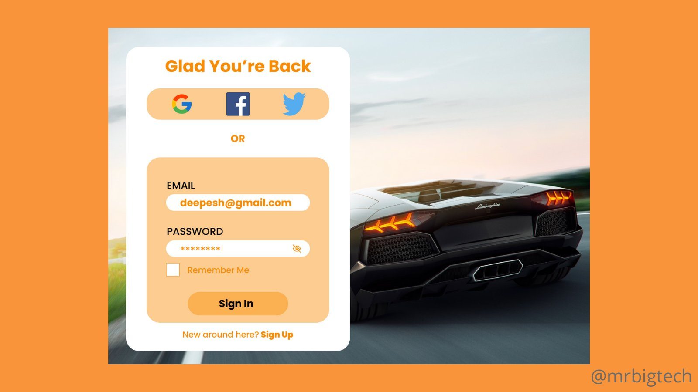

# Signup nd Signin pages
Day 3 of 15 UX designs

#### Design 1

> Color: 
>  background-color:
> button-color: 
> overall-background-color:

#### Design 2

> Color: 
>  background-color:
> button-color: 
> overall-background-color:

#### Design 3

> Color: 
>  background-color:
> button-color: 
> overall-background-color:

#### Design 4

> Color: 
>  background-color:
> button-color: 
> overall-background-color:

#### Design 5

> Color: 
>  background-color:
> button-color: 
> overall-background-color:

#### Design 6

> Color: 
>  background-color:
> button-color: 
> overall-background-color:

#### Design 7

> Color: 
>  background-color:
> button-color: 
> overall-background-color:

